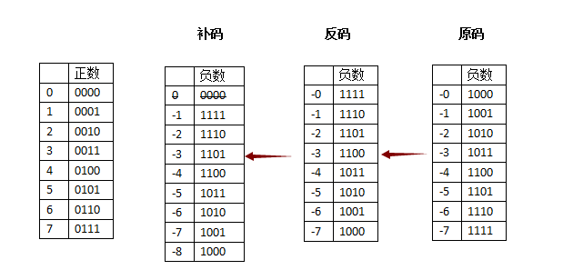

### 定义
原码:我们正常理解的二进制数。第一位为符号位，另外的位用正常的二进制计算即可。
如:
> 1-> 0000 0001  
> -1-> 1000 0001

反码：正数的反码和原码相同，负数除符号位以外取反。
如:

> 1-> 0000 0001  
> -1-> 1111 1110

补码：正数的补码与原码相同，负数是反码加一。
如:

> 1-> 0000 0001  
-1-> 1111 1111

### 在计算机中的使用

**在计算机中，数值一律用补码来表示和存储。而不是我们熟悉的原码。**  
之所以采用补码，我们用原码和反码做下加法就知道了。（由于符号位的存在，计算机内所有的减法都以加法运算，**符号位也参与运算，溢出抛掉**）

比如-1+1，用原码相加的话，就是 0000 0001 + 1000 0001 = 1000 0010 = -2，明显就不符合要求。

用反码计算，0000 0001(反码) + 1111 1110（反码) = 1111 1111（反码）= 1000 0000（原码） =  -0，这是符合要求的。
但是反码会出现一个问题，会出现啊出+0（0000 0000）和-0（1111 1111）这两个一样的数。

于是补码出现了，给反码加个1，把-0干掉，1000 000用来多表示一位最小的负数，这样变相还能多表示一个数。

这样，算什么数都很方便了。

比如：

1-1 = 0000 0001（补码）+ 1111 1111（补码） = 0000 0000（补码） = 0000 0000(原码) = 0

6-4 = 0000 0110（原码）+ 1000 0100（原码）  
    = 0000 0110（反码）+ 1111 1011（反码）  
    = 0000 0110（补码）+ 1111 1100（补码）  
    = 0000 0010（补码）  
    = 0000 0010 (原码)
    = 2

6-9 = 0000 0110（原码）+ 1000 1001（原码）  
    = 0000 0110（反码）+ 1111 0110（反码）  
    = 0000 0110（补码）+ 1111 0111（补码）  
    = 1111 1101（补码）  
    = 1111 1100（补码）  
    = 1000 0011 (原码)
    = -3

### 相关题目
[输出二进制数表示中 1 的个数](../app/src/test/java/com/kowksiuwang/everythingaboutandroid/leetcode/lc0191_HammingWeight/HammingWeight.java)